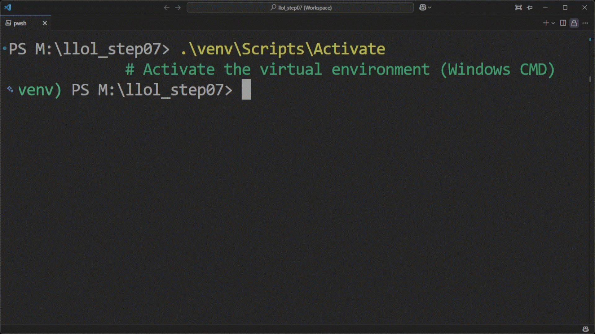

# llol_step08

[](https://www.python.org/)
[](https://flask.palletsprojects.com/)
[](https://www.postgresql.org/)
[](https://www.transifex.com/)

[](https://github.com/TamerOnLine/llol_step08/actions/workflows/main.yml)
[](https://github.com/TamerOnLine/llol_step08/actions/workflows/postgres-check.yml)
[](https://github.com/TamerOnLine/llol_step08/actions/workflows/test.yml)
[](https://github.com/TamerOnLine/llol_step08)
[](https://codecov.io/gh/TamerOnLine/llol_step08)

[](https://github.com/TamerOnLine/llol_step08/releases)

[](https://github.com/TamerOnLine/llol_step08)

[](https://github.com/TamerOnLine/llol_step08)
[](https://github.com/TamerOnLine/llol_step08)

---

## 📖 Overview

**llol_step07** is the seventh milestone of an open-source dynamic resume builder aimed at empowering multilingual content creation, real-time editing, and customization. It's built for developers who need structured, localized, and exportable resume content managed through a Flask-based admin interface.

---

### 📦 Clone & Setup

Follow these steps to clone the repository and set up your development environment:

```bash
git clone https://github.com/TamerOnLine/llol_step08.git  # Clone the project repository from GitHub
cd llol_step08                                            # Navigate into the project directory
python -m venv venv                                       # Create a virtual environment named 'venv'
.\venv\Scripts\Activate                                  # Activate the virtual environment (Windows CMD)
python -m pip install --upgrade pip                       # Upgrade pip to the latest version
pip install -r requirements.txt                           # Install all required dependencies
```

#### 💡 Tip
> If you're using PowerShell, replace the activation command with:
> ```powershell
> .\venv\Scripts\Activate.ps1
> ```

#### 🎬 Demo

<p align="center">
  <a href="screenshots/install.gif">
    
  </a>
</p>

> 📽️ The video above shows the complete setup process for the `llol_step07` repository, from cloning to installing dependencies.

---

### 🌐 Internationalization: Running the `i18n_translate` Module

To automatically generate or update translation files for your project, run the following command:

```bash
py -m main.i18n_translate
```

This module extracts translatable strings, creates `.po` files for each supported language (if they don't exist), and optionally translates them using automated tools such as `deep-translator`.

#### 📁 Output

- `translations/` folder with updated `.po` files per language.
- Automatic generation of `.pot` template file based on source code and templates.

#### 🎬 Demo

<p align="center">
  <a href="screenshots/i18n_translate.gif">
    
  </a>
</p>

>📽️ This tool streamlines the i18n workflow by integrating extraction, translation, and file generation in a single command.

---

## 🌍 Features

- 🌐 Multi-language support using `Flask-Babel`
- 🔄 Automatic translation using `deep-translator`
- 🧾 Live editing of sections, paragraphs, and fields
- 🎛️ Admin dashboard for dynamic content management
- 🐘 PostgreSQL as the primary database
- 🎨 Ready for resume theming and customization

---

## 🧩 Database Schema

The resume structure is built dynamically using the following tables:

- `ResumeSection`: Top-level sections (e.g., Education, Work Experience)
- `ResumeParagraph`: Paragraphs under each section with `field_type`
- `ResumeField`: Key-value pairs inside each paragraph; supports multilingual content
- `Setting`: Stores design and display options as JSON
- `LanguageOption`: Manages supported languages
- `NavigationLink`: Handles sidebar/menu navigation

A ResumeSection contains multiple ResumeParagraphs, and each ResumeParagraph includes multiple ResumeFields.

---

### 🎨 Custom Styling via Settings

You can control the appearance of your resume using the admin panel:

- **Section Title Styling**: font-size, color, weight
- **Paragraph Styling**: font-size, color
- **Body Font**: custom font stack

These are stored as JSON in the `Setting` table and dynamically applied to your resume.

---

### 🗂️ Key Files

| File | Purpose |
|------|---------|
| `main_routes.py` | Public routes (home, index, language selector) |
| `admin_builder_routes.py` | Admin: section CRUD |
| `admin_paragraph.py` | Admin: paragraph CRUD |
| `admin_field.py` | Admin: field CRUD and reordering |
| `i18n_translate.py` | Auto translation and `.po` file generation |
| `run.py` | App bootstrap with DB creation |


### 🚀 Running the Flask App

To start the development server, run the following command:

```bash
py -m run
```

This will:
- Connect to the PostgreSQL admin database.
- Create the working database `postgreslebenslauf` (if not already existing).
- Create required tables.
- Launch the Flask app in development mode with debugging enabled.

#### 🎬 Demo

<p align="center">
  <a href="screenshots/run.gif">
    
  </a>
</p>

> 📽️ The animation above shows how the application is launched and confirms successful connection to the database.

---

## 📂 Project Structure

```bash
main/
├── models.py
├── routes.py
├── templates/
│   └── base.html.j2
├── static/
│   └── css/resume.css
├── translations/
└── ...
```

---

## 🧪 Running Tests

```bash
pytest
```

> Coming soon: Unit tests for translation, section logic, and UI views.

---

## 🗺️ Roadmap

- ✅ Step 07: Translation engine + dynamic sections
- ⏭️ Step 08: Admin interface for language settings
- 🔒 Step 09: Add authentication for admin users
- 📄 Step 10: Export resume to PDF

---

## 🧰 Built With

- [Flask](https://flask.palletsprojects.com/)
- [SQLAlchemy](https://www.sqlalchemy.org/)
- [Flask-Babel](https://python-babel.github.io/flask-babel/)
- [PostgreSQL](https://www.postgresql.org/)
- [deep-translator](https://pypi.org/project/deep-translator/)

---

## 📜 License

This project is open-source under the MIT License.  
Feel free to explore and build upon it.

---

## 👨‍💻 Developer - Connect With Me

[](https://github.com/TamerOnLine)
[](https://www.linkedin.com/in/tameronline/)
[](https://www.youtube.com/@mystrotamer)


By [@TamerOnLine](https://github.com/TamerOnLine)  
Under the umbrella of [Flask University](https://github.com/Flask-University)